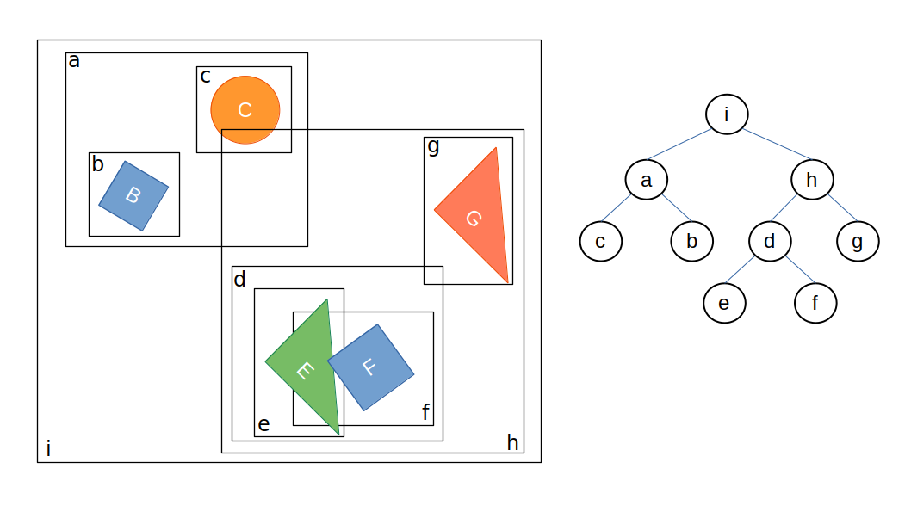

# Dynamic tree

The dynamic tree in Jitter holds instances which implement the `IDynamicTreeProxy` interface.
The main task of the tree is to efficiently determine if a proxy’s axis-aligned bounding box is overlapping with the axis-aligned bounding box of any other proxy in the world.
In a naive implementation this requires $\mathcal{O}\left(n\right)$ operations (checking for an overlap with every of the $n-1$ entities).
The tree structure does accelerate this to $\mathcal{O}\left(\mathrm{log}(n)\right)$. Since proxies are dynamic and can move, the tree must be continuously updated.
To less frequently trigger updates, entities are enclosed within slightly larger bounding boxes than their actual size.
This bounding box extension is defined by the `Velocity` property of the `IDynamicTreeProxy` interface.



## Adding proxies

Jitter automatically registers all shapes added to a rigid body (`body.AddShape`) with the `world.DynamicTree`.
However, users are free to add own implementations of `IDynamicTreeProxy` to the world's tree, using `tree.AddProxy`.
In this case the user has to implement a `BroadPhaseFilter` and register it (using `world.BroadPhaseFilter`) to handle any collisions with the custom proxy, otherwise an `InvalidCollisionTypeException` is thrown.

## Potential pairs

The tree implementation in Jitter needs to be updated using `tree.Update(bool multiThread)`.
This is done automatically for the dynamic tree owned by the world class (`world.DynamicTree`).
This update process generates information about pairs of proxies which either start overlapping, or start to separate.
This 'events' are used to update the `tree.PotentialPairs` hash set, which holds all overlapping pairs.
Inactive pairs of bodies can be pruned from the hashset by calling `tree.TrimInactivePairs` (also done automatically for the dynamic tree owned by the world class).
The Jitter `world` class internally uses the potential pairs to gather more detailed collision information of the pairs and also to generate collision response.

## Querying the tree

All tree proxies that overlap a given axis aligned box can be queried

```cs
public void Query<T>(T hits, in JBBox box) where T : ICollection<IDynamicTreeProxy>
```

as well as all proxies which overlap with a ray

```cs
public void Query<T>(T hits, JVector rayOrigin, JVector rayDirection) where T : ICollection<IDynamicTreeProxy>
```

Custom queries can easily be implemented. An implementation which queries all proxies which have an overlap with a single point can be implemented like this:

```cs
var stack = new Stack<int>();
stack.Push(tree.Root);

while (stack.TryPop(out int id))
{
    ref DynamicTree.Node node = ref tree.Nodes[id];
    
    if (node.ExpandedBox.Contains(point) != JBBox.ContainmentType.Disjoint)
    {
        if (node.IsLeaf)
        {
            Console.WriteLine($'{node.Proxy} contains {point}.');
        }
        else
        {
            stack.Push(node.Left);
            stack.Push(node.Right);
        }
    }
}
```

## Ray casting

All proxies in the tree which implement the `IRayCastable` interface can be raycasted.
This includes all shapes:

```cs
public bool RayCast(JVector origin, JVector direction, RayCastFilterPre? pre, RayCastFilterPost? post,
    out IDynamicTreeProxy? proxy, out JVector normal, out float lambda)
```

The pre- and post-filters can be used to discard hits during the ray cast.
Jitter shoots a ray from the origin into the specified direction.
The function returns `true` if a hit was found.
It also reports the point of collision which is given by

$$$
\mathbf{hit} = \mathbf{origin} + \lambda{}\,\times\,\mathbf{direction}, \quad \textrm{with} \quad \lambda \in [0,\infty).
$$$

The returned `normal` is the normalized surface normal at the hit point.
